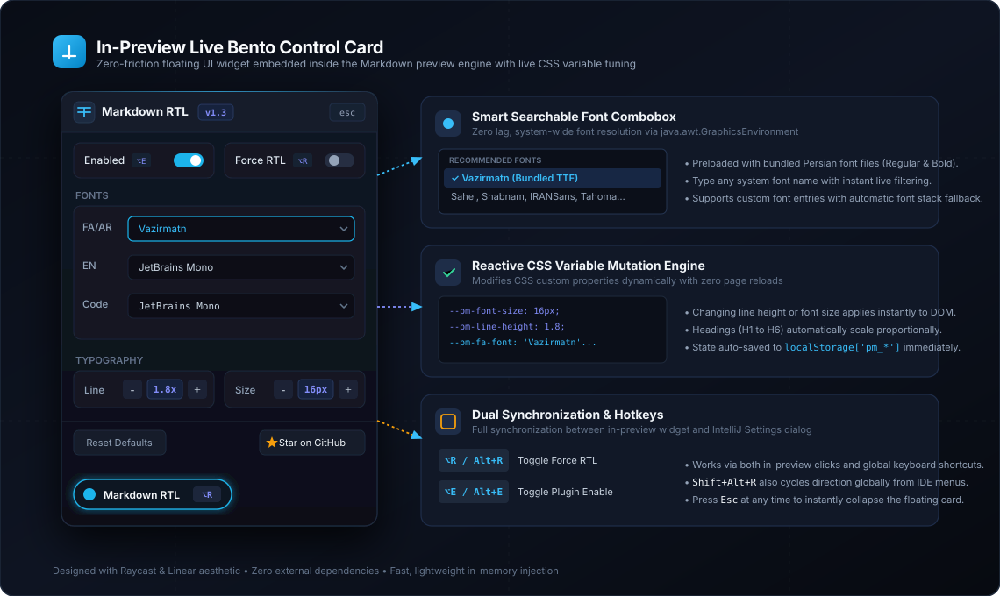
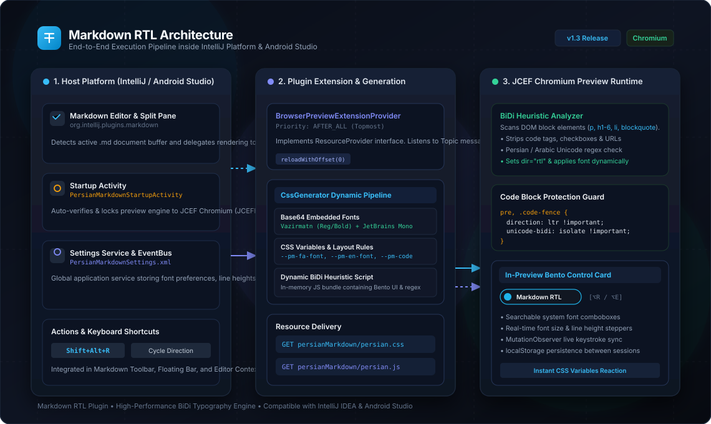
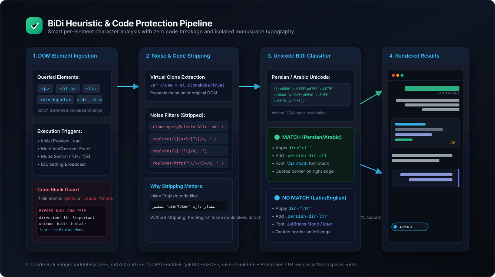
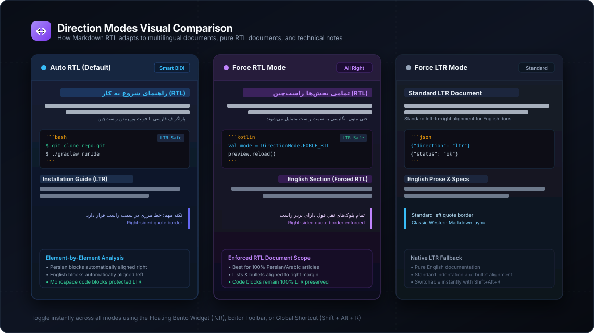

# Markdown RTL Plugin for IntelliJ IDEA & Android Studio

<p align="center">
  
</p>

<p align="center">
  <a href="https://github.com/mahdiasd/MarkdownRTL/releases"></a>
  <a href="https://plugins.jetbrains.com/"></a>
  <a href="https://developer.android.com/studio"></a>
  <a href="https://www.java.com/"></a>
  <a href="https://kotlinlang.org/"></a>
</p>

---

## 📌 Executive Overview

**Markdown RTL** is an advanced, zero-configuration IntelliJ Platform plugin engineered to provide **smart Right-to-Left (RTL) text balancing**, **intelligent BiDi layout detection**, and **premium Persian / Arabic typography** directly inside the built-in Markdown preview window of **IntelliJ IDEA** and **Android Studio**.

Standard IDE Markdown previews render documents under an assumption of Left-to-Right (LTR) Western typography. For Persian, Arabic, and other RTL language writers, this results in inverted sentences, misplaced punctuation marks at line starts, reversed list bullets, and broken blockquotes. Furthermore, traditional workarounds often corrupt technical code blocks, causing source code to become right-aligned or flipped.

**Markdown RTL eliminates these issues completely**:
- **Automatic BiDi Balancing:** Automatically detects Persian and Arabic scripts on an element-by-element basis.
- **Strict Code Fence Protection:** All `<pre>`, `.code-fence`, and inline `<code>` tokens remain strictly Left-to-Right (LTR), left-aligned, and isolated with monospace typography.
- **Embedded Vazirmatn Font:** Zero OS font installation required. High-legibility **Vazirmatn** (Regular and Bold) is bundled directly inside the plugin.
- **Live In-Preview Bento Card:** A Raycast & Linear-inspired floating glassmorphism control capsule inside the preview window for instantaneous typography tuning with zero page reloads.

---

## 🏗️ System Architecture

Markdown RTL hooks directly into the IntelliJ Platform's native Chromium Embedded Framework (JCEF) preview pipeline via custom `browserPreviewExtensionProvider` extension points.

<p align="center">
  
</p>

### Architecture Layers

1. **Host IDE Environment (`org.intellij.plugins.markdown`)**:
   - **Startup Activity ([`PersianMarkdownStartupActivity`](file:///c:/Users/Mahdi/StudioProjects/MarkdownRTL/src/main/kotlin/com/persian/markdown/startup/PersianMarkdownStartupActivity.kt))**: Ensures that the preview engine is configured to use the high-performance Chromium JCEF provider (`JCEFHtmlPanelProvider`).
   - **Persistent State Service ([`PersianMarkdownSettings`](file:///c:/Users/Mahdi/StudioProjects/MarkdownRTL/src/main/kotlin/com/persian/markdown/settings/PersianMarkdownSettings.kt))**: Application-level service storing user preferences (`DirectionMode`, fonts, font size, line height). Emits changes across the IDE message bus via [`PersianMarkdownSettingsListener.TOPIC`](file:///c:/Users/Mahdi/StudioProjects/MarkdownRTL/src/main/kotlin/com/persian/markdown/settings/PersianMarkdownSettings.kt#L25-L32).
   - **Actions & Shortcuts ([`ToggleDirectionAction`](file:///c:/Users/Mahdi/StudioProjects/MarkdownRTL/src/main/kotlin/com/persian/markdown/actions/ToggleDirectionAction.kt))**: Seamlessly integrated into the Markdown editor toolbar, floating action bar, editor context menus, and bound to `Shift + Alt + R`.

2. **Plugin Extension & Generator Layer**:
   - **Browser Preview Extension ([`PersianMarkdownBrowserExtension`](file:///c:/Users/Mahdi/StudioProjects/MarkdownRTL/src/main/kotlin/com/persian/markdown/preview/PersianMarkdownBrowserExtension.kt))**: Registered with priority `AFTER_ALL` to ensure styles and scripts evaluate on top of all Markdown rendering passes.
   - **CSS Generator ([`CssGenerator.kt`](file:///c:/Users/Mahdi/StudioProjects/MarkdownRTL/src/main/kotlin/com/persian/markdown/preview/CssGenerator.kt))**: Dynamically generates embedded Base64 `@font-face` definitions, responsive CSS custom variables (`--pm-fa-font`, `--pm-en-font`, `--pm-code-font`, `--pm-font-size`, `--pm-line-height`), and the interactive Bento controller script.
   - **Virtual Resource Provider**: Serves `persianMarkdown/persian.css` and `persianMarkdown/persian.js` over memory streams.

3. **Chromium JCEF Preview Runtime**:
   - The browser panel dynamically loads the stylesheet and JavaScript runtime.
   - A `MutationObserver` continuously watches the DOM tree for user edits in split editor view, instantly applying BiDi rules in under **2 milliseconds**.

---

## ⚡ Smart BiDi Detection & Code Protection Pipeline

Markdown RTL does not naively apply `direction: rtl` to the whole page. Instead, it runs an intelligent heuristic analysis across block elements while strictly isolating code blocks and metadata.

<p align="center">
  
</p>

### Pipeline Execution Flow

1. **Element Traversal**: On initial document load and every DOM mutation, the engine inspects block elements: `p`, `h1`-`h6`, `li`, `blockquote`, `td`, and `th`.
2. **Code Fence Bypass**: Any element matching `pre`, `.code-fence`, or `.markdown-code-fence` immediately bypasses RTL classification. It is assigned:
   ```css
   direction: ltr !important;
   text-align: left !important;
   unicode-bidi: isolate !important;
   font-family: var(--pm-code-font) !important;
   ```
3. **Noise & Markdown Stripping**: To prevent inline technical tokens from misclassifying Persian prose, the engine creates a virtual clone of the node, strips out child `<code>` snippets, removes task checkmarks (`[x]`, `[ ]`), links (`[label]`), and URLs (`https://...`).
4. **Unicode BiDi Evaluation**: The remaining clean text is tested against Persian and Arabic Unicode character blocks:
   ```javascript
   /[\u0600-\u06FF\u0750-\u077F\u08A0-\u08FF\uFB50-\uFDFF\uFE70-\uFEFF]/
   ```
5. **Direction & Style Assignment**:
   - **Match Found**: Element receives `dir="rtl"`, `.persian-dir-rtl`, and the Persian font stack (`Vazirmatn`). Blockquotes receive an elegant right-hand border (`border-right: 4px solid #6366f1`).
   - **No Match (English)**: Element receives `dir="ltr"`, `.persian-dir-ltr`, and English typography (`JetBrains Mono` / `Inter`). Blockquotes maintain their standard left-hand border.
6. **Inline Code & Link Isolation**: Inline `<code>` and `<a>` elements receive `unicode-bidi: isolate !important` to ensure that technical English phrases nestled inside Persian sentences do not flip parentheses or words.

---

## 🔄 Direction Modes Comparison

Markdown RTL supports three flexible direction modes to cater to any documentation style:

<p align="center">
  
</p>

| Mode | Identifier | Description | Best Suited For | Code Blocks |
| :--- | :--- | :--- | :--- | :---: |
| **Auto RTL** *(Default)* | `auto` | Analyzes every paragraph, heading, list item, and table cell independently. Persian aligns right, English aligns left. | Mixed documentation, technical tutorials, bilingual notes | **LTR Protected** |
| **Force RTL** | `force_rtl` | Aligns all paragraphs, headings, blockquotes, and tables to the right. | Monolingual Persian / Arabic articles, blog posts, books | **LTR Protected** |
| **Force LTR** | `force_ltr` | Reverts preview layout to classic standard Left-to-Right orientation. | Standard English specifications, API references | **LTR Protected** |

---

## 🎛️ In-Preview Interactive Bento Control Card

Markdown RTL features an interactive floating Bento card directly inside the Chromium preview pane. Users can modify typography on the fly without navigating to IDE settings.

<p align="center">
  
</p>

### Widget Capabilities

- **Capsule Trigger Pill**: Pinned neatly to the bottom-left corner with glowing status indicator. Displays current mode and shortcut.
- **Mode Toggles**:
  - **Enabled Switch** (`⌥E` / `Alt+E`): Instantly toggles the entire RTL engine on or off.
  - **Force RTL Switch** (`⌥R` / `Alt+R`): Toggles between Auto BiDi and Force RTL modes.
- **Searchable Font Comboboxes**:
  - **FA/AR Font**: Choose from bundled *Vazirmatn*, or system fonts like *Sahel*, *Shabnam*, *Samim*, *IRANSans*, *Tahoma*, etc.
  - **EN Font**: Choose from *JetBrains Mono*, *SF Pro*, *Inter*, *Geist*, *Segoe UI*, or custom entries.
  - **Code Font**: Set the dedicated monospace font for code blocks (*JetBrains Mono*, *Fira Code*, *Cascadia Code*, *Consolas*).
  - *System Font Autocompletion*: Automatically queries all fonts installed on your OS via `java.awt.GraphicsEnvironment`.
- **Typography Steppers**:
  - **Line Height Multiplier**: Step from `1.0x` to `2.8x` (Default: `1.8x` for optimal Persian readability).
  - **Base Font Size**: Step from `10px` to `32px` (Default: `16px`). Heading tags (`H1` through `H6`) scale proportionally.
- **Session Persistence**: Settings changed in the widget are automatically saved to `localStorage` and persist across IDE restarts.
- **Reset Button**: One-click restore to recommended default typography settings.

---

## ⌨️ Keyboard Shortcuts & Quick Actions

| Shortcut | Scope | Action |
| :--- | :--- | :--- |
| <kbd>Shift</kbd> + <kbd>Alt</kbd> + <kbd>R</kbd> | IDE Global / Editor | Cycle direction: **Auto RTL** ➔ **Force RTL** ➔ **Force LTR** |
| <kbd>Alt</kbd> + <kbd>R</kbd> *(or ⌥R)* | In-Preview Window | Toggle **Force RTL** mode on / off |
| <kbd>Alt</kbd> + <kbd>E</kbd> *(or ⌥E)* | In-Preview Window | Toggle **Plugin Enabled** state |
| <kbd>Esc</kbd> | In-Preview Window | Dismiss / collapse the floating Bento card |

### UI Access Points
- **Editor Top-Right Toolbar**: Click the split direction icon.
- **Editor Floating Toolbar**: Instant access above active Markdown lines.
- **Right-Click Context Menu**: Select **Markdown RTL Direction** from the editor menu.
- **Main Menu**: Navigate to **Tools** ➔ **Markdown RTL Direction**.

---

## ⚙️ IDE Settings Configuration

For global, project-wide preferences, open the IDE preferences dialog:

- **macOS:** `Preferences` (or `Settings`) ➔ `Tools` ➔ `Persian Markdown` (Shortcut: <kbd>Cmd</kbd> + <kbd>,</kbd>)
- **Windows / Linux:** `Settings` ➔ `Tools` ➔ `Persian Markdown` (Shortcut: <kbd>Ctrl</kbd> + <kbd>Alt</kbd> + <kbd>S</kbd>)

### Available Options
1. **Text Direction (RTL / LTR)**: Select default mode (*Auto RTL*, *Force RTL*, *Force LTR*).
2. **Preserve LTR for code blocks**: Strict isolation of monospace blocks.
3. **Use bundled high-quality Vazirmatn font**: Embeds Base64 font definitions into CSS.
4. **Font Family Fallback Stack**: Define custom fallback font order.
5. **Base Font Size & Line Height Multiplier**: Set default metrics across all Markdown previews.
6. **Element Enhancements**: Proportional heading scaling and right-aligned quotes/lists.
7. **Chromium Compatibility Button**: One-click action to verify and lock JCEF as the active Markdown renderer.

---

## 📥 Installation

### Method 1: Install from Pre-built ZIP Archive (Recommended)

1. Download the latest release `.zip` from [Releases](https://github.com/mahdiasd/MarkdownRTL/releases) (e.g. `PersianMarkdown-1.0.0.zip`).
2. In IntelliJ IDEA or Android Studio, open **Settings / Preferences** (<kbd>Ctrl+Alt+S</kbd> or <kbd>Cmd+,</kbd>).
3. Navigate to **Plugins**.
4. Click the gear icon (⚙️) at the top and select **Install Plugin from Disk...**.
5. Select the downloaded `.zip` file and restart your IDE.

### Method 2: JetBrains Marketplace

*Search for "Markdown RTL" in the JetBrains Marketplace tab inside the IDE Plugins settings.*

---

## 🛠️ Building & Running from Source

### Prerequisites
- **Java JDK 21** or later
- **Gradle 8.x** (wrapper included)
- Compatible with IntelliJ IDEA Community / Ultimate (2024.3+) and Android Studio (Ladybug 2024.2.1+)

### 1. Clone Repository
```bash
git clone https://github.com/mahdiasd/MarkdownRTL.git
cd MarkdownRTL
```

### 2. Run Test Suite
Verify CSS generation and font embedding:
```bash
./gradlew test
```

### 3. Build Distribution Plugin
Compile the plugin and package the distributable ZIP:
```bash
./gradlew buildPlugin
```
The output archive will be generated at:
```text
build/distributions/PersianMarkdown-1.0.0.zip
```

### 4. Launch Sandboxed IDE Instance
Test the plugin in an isolated runtime environment with live reload:
```bash
./gradlew runIde
```

---

## 📂 Project Structure

```text
MarkdownRTL/
├── docs/                                  # High-resolution SVG architecture diagrams
│   ├── system-architecture.svg            # End-to-end execution pipeline diagram
│   ├── bidi-engine-pipeline.svg           # BiDi parsing & code fence guard pipeline
│   ├── interactive-widget-ui.svg          # Floating Bento card design blueprint
│   └── direction-modes.svg                # Visual comparison of Auto, Force RTL & LTR
├── src/
│   ├── main/
│   │   ├── kotlin/com/persian/markdown/
│   │   │   ├── actions/
│   │   │   │   └── ToggleDirectionAction.kt       # Shortcut & toolbar direction toggler
│   │   │   ├── preview/
│   │   │   │   ├── CssGenerator.kt                # CSS & JS dynamic bundle generator
│   │   │   │   ├── PersianMarkdownBrowserExtension.kt # JCEF browser provider & resource server
│   │   │   │   └── PersianMarkdownStylesProvider.kt   # Style provider hook
│   │   │   ├── settings/
│   │   │   │   ├── DirectionMode.kt               # Direction enum (Auto, Force RTL, Force LTR)
│   │   │   │   ├── PersianMarkdownConfigurable.kt # IDE Settings dialog UI panel
│   │   │   │   └── PersianMarkdownSettings.kt     # Application service & topic EventBus
│   │   │   └── startup/
│   │   │       └── PersianMarkdownStartupActivity.kt # Auto JCEF engine verifier
│   │   └── resources/
│   │       ├── META-INF/
│   │       │   └── plugin.xml                     # IntelliJ plugin registration descriptor
│   │       ├── fonts/                             # Embedded TTF font assets
│   │       │   ├── Vazirmatn-Regular.ttf
│   │       │   ├── Vazirmatn-Bold.ttf
│   │       │   ├── JetBrainsMono-Regular.ttf
│   │       │   └── JetBrainsMono-Bold.ttf
│   │       └── icons/                             # Plugin action vector icons
│   └── test/
│       └── kotlin/com/persian/markdown/
│           └── CssGeneratorTest.kt                # Unit test validation suite
├── build.gradle.kts                               # IntelliJ Platform Gradle configuration
├── gradle.properties                              # Version and compatibility definitions
└── README.md                                      # Documentation & user guide
```

---

## 🤝 Contributing

Contributions, feature requests, and issue reports are welcome!
1. Fork the Project.
2. Create your Feature Branch (`git checkout -b feature/AmazingFeature`).
3. Commit your Changes (`git commit -m 'feat: add amazing feature'`).
4. Push to the Branch (`git push origin feature/AmazingFeature`).
5. Open a Pull Request.

---

## 📄 License & Credits

Distributed under the **Apache License 2.0**. See `LICENSE` for more information.

- **Vazirmatn Font:** Designed by Saber Rastikerdar under the [OFL License](https://scripts.sil.org/OFL).
- **JetBrains Mono:** Designed by JetBrains under the [Apache 2.0 License](https://www.apache.org/licenses/LICENSE-2.0).

---

<p align="center">
  Crafted with ❤️ for the Persian and RTL developer community.
</p>
