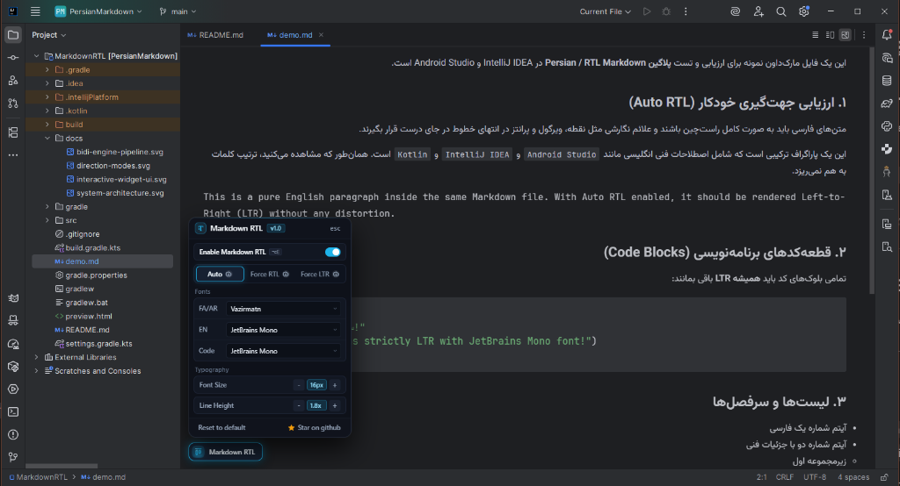
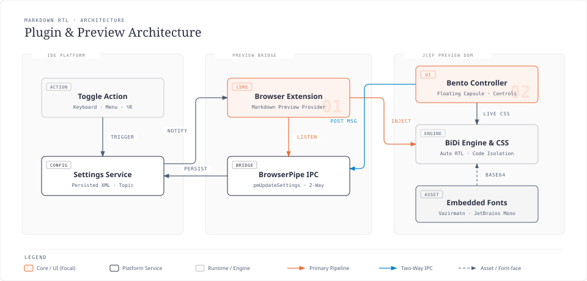

# Markdown RTL for IntelliJ IDEA & Android Studio

<p align="center">
  
</p>

<p align="center">
  <b>Intelligent Right-to-Left (RTL) Balancing, Smart BiDi Detection, and Persian/Arabic Typography for Markdown Previews in IntelliJ IDEA & Android Studio</b>
</p>

<p align="center">
  <a href="https://plugins.jetbrains.com/plugin/34457-markdown-rtl"></a>
  <a href="https://plugins.jetbrains.com/plugin/34457-markdown-rtl"></a>
  <a href="https://plugins.jetbrains.com/plugin/34457-markdown-rtl"></a>
  <a href="https://github.com/mahdiasd/MarkdownRTL"></a>
  <a href="https://github.com/mahdiasd/MarkdownRTL/issues"></a>
  <a href="LICENSE"></a>
</p>

<p align="center">
  <a href="#-quick-start--installation"><b>⚡ Install Now</b></a> •
  <a href="https://plugins.jetbrains.com/plugin/34457-markdown-rtl"><b>📦 Marketplace Page</b></a> •
  <a href="https://github.com/mahdiasd/MarkdownRTL/issues"><b>🐛 Report Issue</b></a> •
  <a href="#️-architecture--system-structure"><b>🏛️ Architecture</b></a> •
  <a href="#-support--feedback"><b>⭐ Star Project</b></a>
</p>

---

## 🚀 Quick Start & Installation

You can install **Markdown RTL** directly inside your IDE or download the distribution archive.

### Method 1: JetBrains Marketplace (In-IDE) — Recommended
1. Open **IntelliJ IDEA**, **Android Studio**, or any JetBrains IDE.
2. Open Settings:
   - **Windows / Linux:** <kbd>Ctrl</kbd> + <kbd>Alt</kbd> + <kbd>S</kbd>
   - **macOS:** <kbd>Cmd</kbd> + <kbd>,</kbd>
3. Navigate to **Plugins** ➔ **Marketplace** tab.
4. Search for **`Markdown RTL`**.
5. Click **Install**, then restart the IDE.

### Method 2: JetBrains Marketplace (Web)
Visit the official plugin page:  
👉 **[https://plugins.jetbrains.com/plugin/34457-markdown-rtl](https://plugins.jetbrains.com/plugin/34457-markdown-rtl)**  
Click **Get** ➔ **Install to...** to install directly into your running IDE.

### Method 3: Offline / Manual Installation (.ZIP)
1. Download the latest `PersianMarkdown-x.x.x.zip` from [GitHub Releases](https://github.com/mahdiasd/MarkdownRTL/releases).
2. Open **Settings / Preferences** ➔ **Plugins**.
3. Click the **Gear icon (⚙️)** ➔ **Install Plugin from Disk...**.
4. Select the downloaded `.zip` file and restart your IDE.

---

## 👁️ Usage in IntelliJ IDEA & Android Studio

Markdown RTL works natively inside the **Markdown Preview Pane**:

1. Open any Markdown file (`.md`).
2. Switch the view mode in the top-right corner to **Split View** (Editor and Preview) or **Preview Only**.
3. Persian and Arabic prose will automatically render Right-to-Left with proper punctuation and *Vazirmatn* typography, while all code blocks remain strictly Left-to-Right.
4. YAML Front Matter blocks (`--- ... ---`) are automatically rendered as an interactive metadata table card with BiDi support.
5. Click the floating **Markdown RTL** capsule at the bottom-left to adjust fonts, sizes, line heights, or direction modes.

---

## ✨ Key Features

- 🔄 **Smart BiDi Detection (Auto Mode):** Analyzes paragraphs, headings, and lists dynamically. Persian and Arabic align right; pure English stays left.
- 📊 **Native Mermaid Diagram Support:** Automatically renders ` ```mermaid ` code fences into interactive SVG diagrams completely offline. Pure English diagrams use *JetBrains Mono* by default, while Persian/Arabic diagrams automatically utilize *Vazirmatn* with RTL-aligned text labels. Includes Diagram/Source view toggles, copy SVG/code, and clean inline zoom (+ / −) controls.
- 📑 **Smart YAML Front Matter Card:** Seamlessly parses and renders document metadata blocks (`--- ... ---`) into a modern card with field-level BiDi alignment, array badges, clickable URLs, and quick **Raw YAML / Copy** toggles.
- 🛡️ **Bulletproof Code Isolation:** Monospace code fences (`<pre>`, `.code-fence`, `<code>`) are strictly protected as LTR and left-aligned.
- 🎛️ **In-Preview Bento Controller:** Floating modern widget to toggle modes, choose fonts (Persian, English, Code), and adjust font size and line height on the fly.
- 🖋️ **Embedded Fonts Included:** Bundled with high-legibility **Vazirmatn** and **JetBrains Mono**—works out of the box on Windows, macOS, and Linux without installing fonts.
- 💾 **Instant Persistence:** Changes made in the floating widget are automatically saved in `localStorage` across IDE sessions.
- ⚡ **Zero Markdown Mutation:** Operates completely in the preview DOM layer without touching or dirtying your raw markdown files.

---

## 🔄 Direction Modes & Shortcuts

| Mode | Key Action | Description |
| :--- | :--- | :--- |
| **Auto RTL** *(Default)* | Auto BiDi | Detects language per element. Best for bilingual notes and mixed documentation. |
| **Force RTL** | <kbd>Alt</kbd> + <kbd>R</kbd> *(or <kbd>⌥R</kbd>)* | Aligns all prose to the right. Ideal for Persian/Arabic articles and books. |
| **Force LTR** | Revert LTR | Standard Left-to-Right layout for pure English technical specifications. |

### Shortcuts Reference:
- <kbd>Alt</kbd> + <kbd>R</kbd> / <kbd>⌥R</kbd>: Toggle between **Auto RTL** and **Force RTL**
- <kbd>Alt</kbd> + <kbd>E</kbd> / <kbd>⌥E</kbd>: Toggle **Plugin Enabled / Disabled**
- <kbd>Shift</kbd> + <kbd>Alt</kbd> + <kbd>R</kbd>: Cycle modes (**Auto** ➔ **Force RTL** ➔ **Force LTR**)
- <kbd>Esc</kbd>: Close floating Bento widget

---

## 🏛️ Architecture & System Structure

<p align="center">
  
</p>

---

## ⭐ Support & Feedback

If you find **Markdown RTL** helpful, please consider supporting the project:

- **⭐ Star on GitHub:** [github.com/mahdiasd/MarkdownRTL](https://github.com/mahdiasd/MarkdownRTL)
- **🌟 Rate on Marketplace:** [plugins.jetbrains.com/plugin/34457-markdown-rtl](https://plugins.jetbrains.com/plugin/34457-markdown-rtl)
- **🐛 Report Issues & Suggestions:** [GitHub Issues](https://github.com/mahdiasd/MarkdownRTL/issues)

---

## 🛠️ Building from Source

```bash
# 1. Clone repository
git clone https://github.com/mahdiasd/MarkdownRTL.git
cd MarkdownRTL

# 2. Run unit tests
./gradlew test

# 3. Build distributable plugin archive
./gradlew buildPlugin
```
The output package will be generated at: `build/distributions/PersianMarkdown-1.0.2.zip`.

---

## 🙏 Acknowledgements

- **UI & Settings Card Inspiration:** [antigravity-rtl](https://github.com/mmnaderi/antigravity-rtl) by [@mmnaderi](https://github.com/mmnaderi) — special thanks for the insightful floating controller concept and RTL tooling efforts.

---

## 📄 License

Distributed under the **Apache License 2.0**. See [`LICENSE`](LICENSE) for details.

- **Vazirmatn Font:** By Saber Rastikerdar ([OFL License](https://scripts.sil.org/OFL)).
- **JetBrains Mono:** By JetBrains ([Apache 2.0 License](https://www.apache.org/licenses/LICENSE-2.0)).

<p align="center">
  Crafted with ❤️ for the Persian and RTL developer community.
</p>
