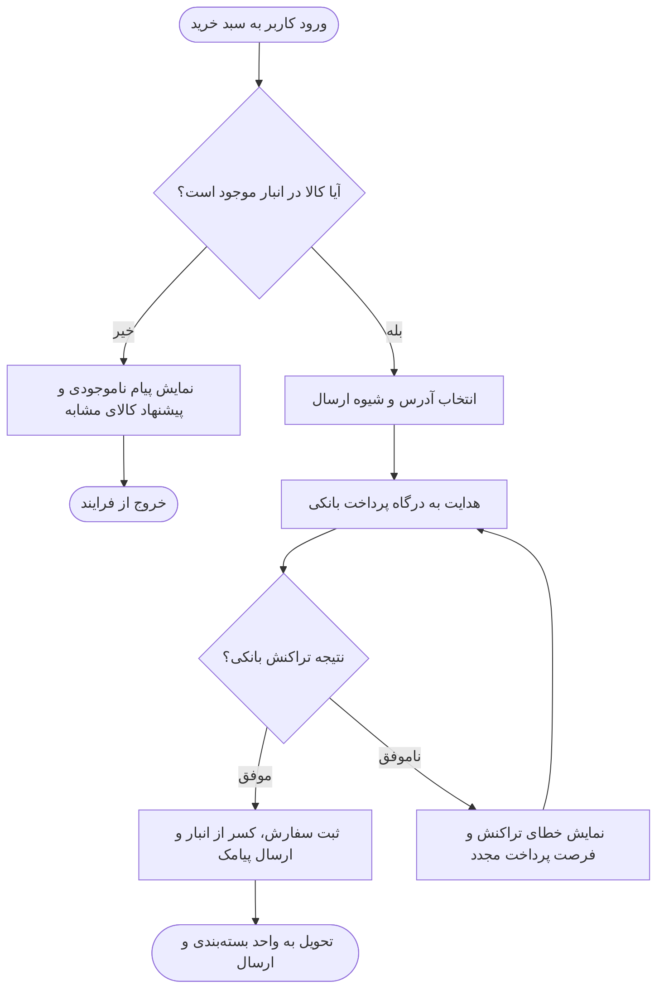
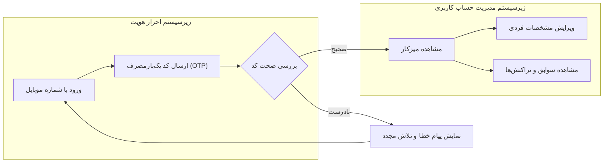

# نمودار جریان فارسی (Flowchart Persian)

این سند برای بررسی و تست نمایش **نمودارهای جریان تمام‌فارسی (Flowchart)** در افزونه **Markdown RTL** تهیه شده است.

## اهداف آزمون
- تشخیص خودکار زبان فارسی در نمودار و اعمال قلم **وزیرمتن (Vazirmatn)**
- چیدمان صحیح راست‌به‌چپ (RTL) در برچسب‌های متنی و گره‌ها
- خوانایی خطوط پیوند، شرط‌ها و زیرنمودارها (Subgraphs)

---

## سناریوی ۱: فرایند ثبت سفارش فروشگاه اینترنتی

---

## سناریوی ۲: زیرنمودارها (Subgraphs) و دسته‌بندی وظایف

---

## نکات قابل بررسی
1. آیا متن درون کادرهای بیضی، مستطیل و لوزی به فونت وزیرمتن نمایش می‌یابد؟
2. آیا برچسب روی یال‌ها (مثل «بله»، «خیر»، «موفق»، «ناموفق») خوانا و بدون به‌هم‌ریختگی حروف فارسی هستند؟
3. آیا دکمه‌های نوار ابزار (بزرگ‌نمایی، بازنشانی و تمام‌صفحه) در بالای نمودار به‌درستی فعال می‌شوند؟
