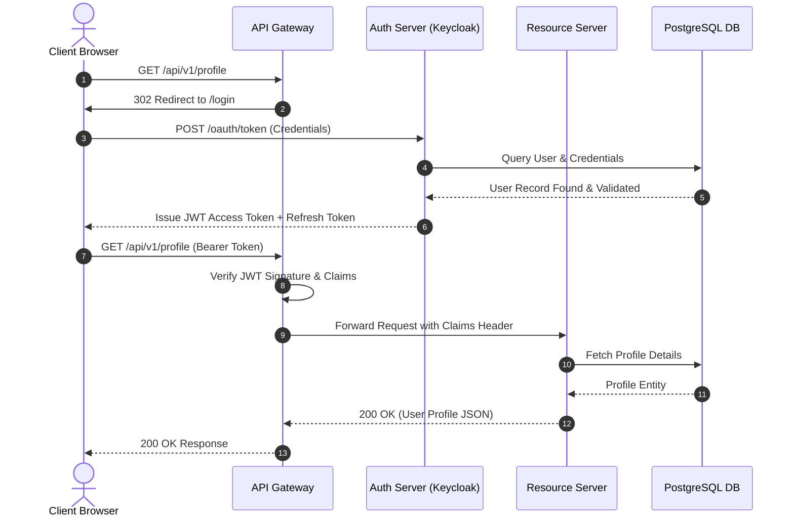
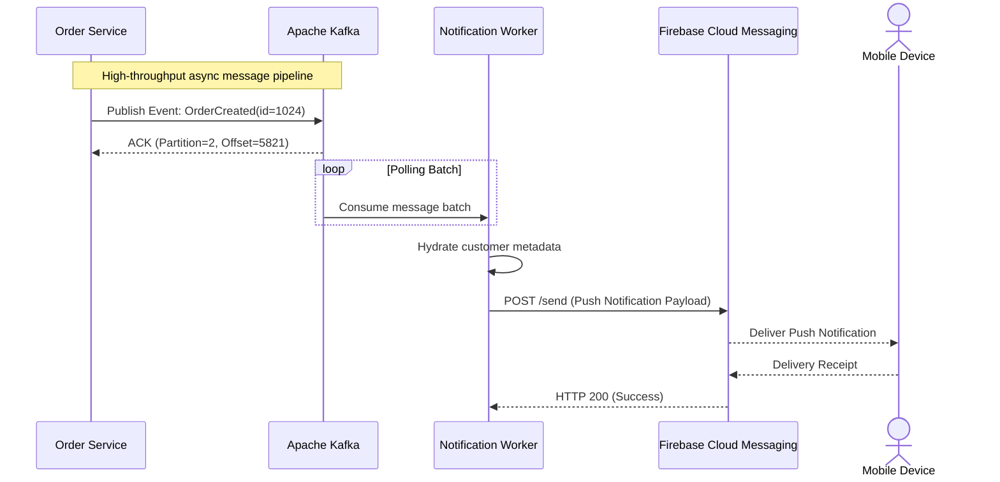

# English Sequence Diagram (Pure English Font Test)

This document tests the **English font detection** and **Sequence Diagram** rendering in the **Markdown RTL** plugin.

## Test Objective
As per user requirements:
> When the diagram content is in English, the default code font (`JetBrains Mono`, system monospace) must be applied automatically instead of the Persian font (`Vazirmatn`).

---

## Scenario 1: OAuth2 Authentication & Authorization Code Flow

---

## Scenario 2: Async Event-Driven Message Processing

---

## Verification Points
1. **Typography**: Does the diagram use `JetBrains Mono` or default monospace font? (Confirm Persian font `Vazirmatn` is **not** applied to this pure English diagram).
2. **Alignment & Orientation**: Is the text aligned LTR with proper participant box paddings?
3. **Interactive Features**: Can you zoom, pan, and open this sequence diagram in the fullscreen modal without layout distortions?
