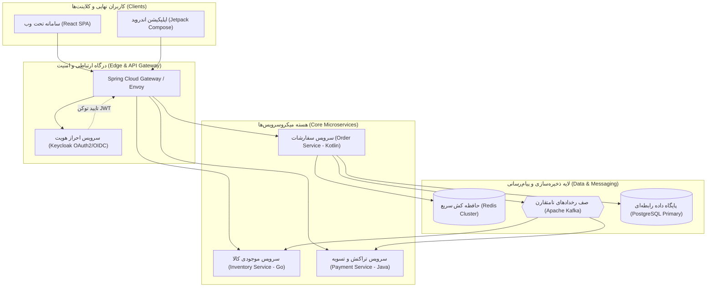

# معماری دوزبانه (Bilingual Architecture Diagram)

این سند برای بررسی و ارزیابی رفتار افزونه **Markdown RTL** در نمودارهای فنی که شامل ترکیبی از **واژگان تخصصی انگلیسی** و **توضیحات فارسی** هستند طراحی شده است.

## هدف آزمون
- اطمینان از اعمال قلم **وزیرمتن (Vazirmatn)** به دلیل وجود نویسه‌های فارسی در نمودار
- حفظ فونت مونو یا انگلیسی تمیز برای کلمات تخصصی لاتین (نظیر Redis، Kafka، Docker و ...)
- عدم به هم ریختگی پرانتزها، اختصارات انگلیسی و اعداد فارسی/انگلیسی در متن گره‌ها

---

## سناریوی ۱: معماری میکروسرویس سازمانی (Enterprise Microservices)



---

## سناریوی ۲: خط لوله استقرار و انتشار (CI/CD Pipeline)

```mermaid
flowchart LR
    کد["ثبت تغییرات (Git Commit)"] --> گیت‌هاب["مخزن کد (GitHub Repo)"]
    گیت‌هاب --> اکشن["اجرای تست‌ها (GitHub Actions Runner)"]
    
    subgraph بررسی_کیفیت ["ارزیابی خودکار کیفیت"]
        اکشن --> تست_واحد["تست واحد (Unit Tests)"]
        اکشن --> تحلیل_کد["تحلیل کیفیت (SonarQube)"]
    end
    
    تست_واحد --> بیلد["ساخت بسته اجرایی (Docker Build)"]
    تحلیل_کد --> بیلد
    
    بیلد --> رجیستری["بارگذاری ایمیج (Container Registry)"]
    رجیستری --> کوبرنتیز["استقرار روی کلاستر (Kubernetes Staging)"]
```

---

## موارد ارزیابی در پیش‌نمایش
1. واژه‌های درون پرانتز انگلیسی (مانند `React SPA` یا `Redis Cluster`) بعد از کلمات فارسی به درستی در جهت متنی قرار گرفته‌اند؟
2. برچسب خطوط دارای خط فاصله و نقطه (نظیر `JWT`) بدون جابه‌جایی نمایش داده می‌شوند؟
3. رنگ‌بندی تم تاریک و روشن (Dark / Light Theme) با تم فعال IDE کاملاً هماهنگ است؟
