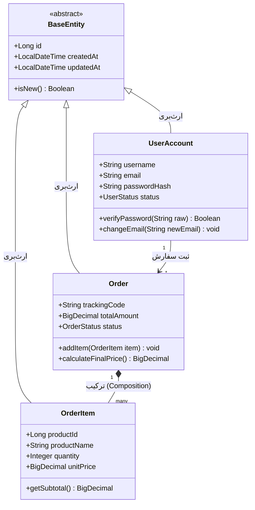
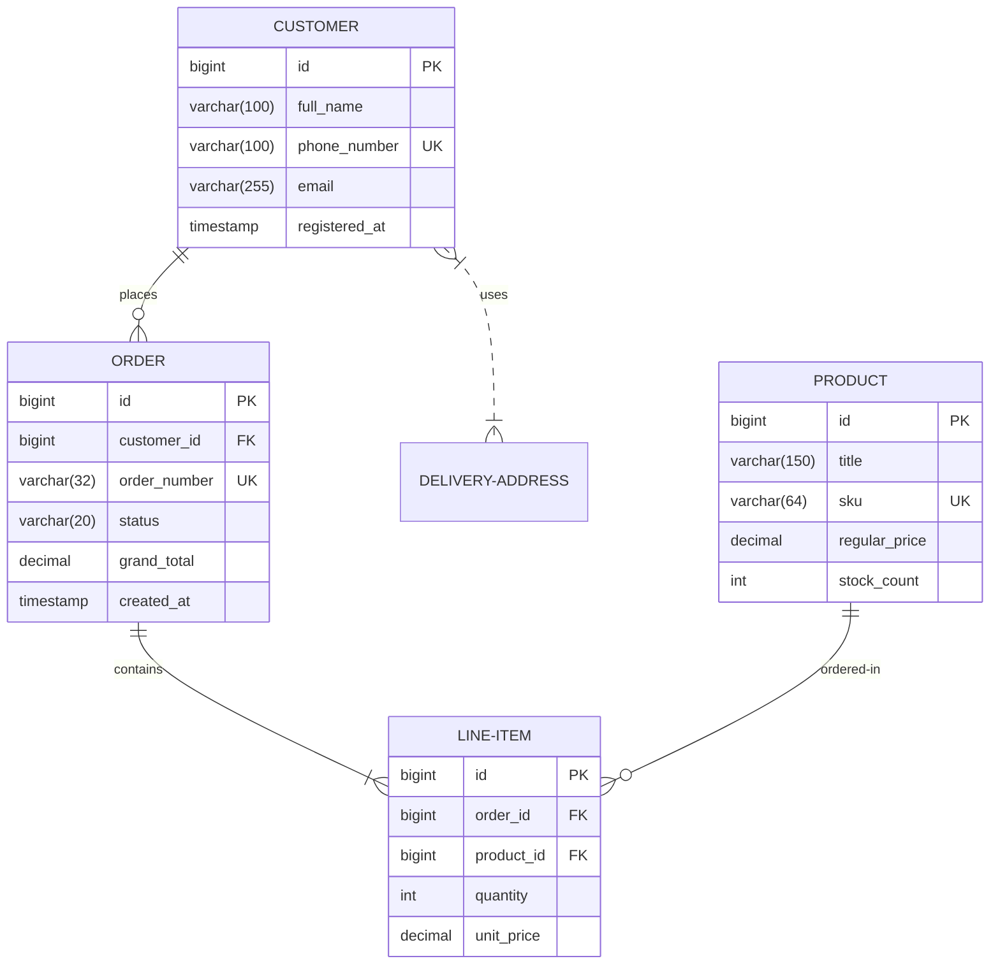
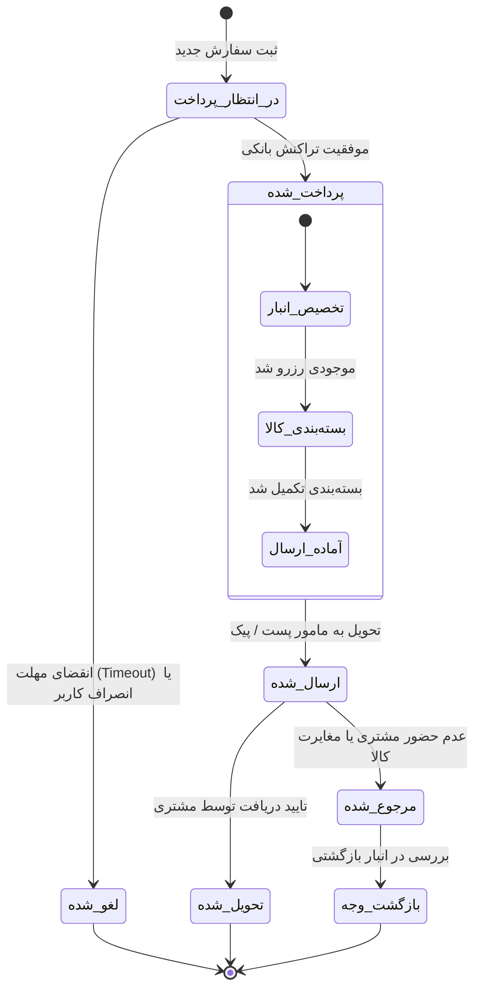

# نمودارهای کلاس، موجودیت و وضعیت (Class, ER & State Diagrams)

این سند برای بررسی پشتیبانی کامل افزونه از انواع نمودارهای پرکاربرد مهندسی نرم‌افزار در مِرمید (شامل `classDiagram`، `erDiagram` و `stateDiagram-v2`) طراحی شده است.

## هدف آزمون
- اطمینان از عملکرد موتور `mermaid.min.js` داخلی در رسم دیاگرام‌های پیشرفته غیر از Flowchart
- بررسی صحت رندر سمبل‌های رابطه‌ای (`||--o{`، `--|>`، `*--` و ...)
- نمایش صحیح تایپ‌ها و متدها در ساختارهای جدولی دیاگرام

---

## سناریوی ۱: نمودار کلاس شی‌گرا (Class Diagram)

---

## سناریوی ۲: نمودار رابطه موجودیت‌ها (ER Diagram)

---

## سناریوی ۳: ماشین وضعیت چرخه عمر سفارش (State Diagram)

---

## موارد ارزیابی در پیش‌نمایش
1. رندر شدن صحیح همه ۳ نوع نمودار بدون پرتاب خطای جاوااسکریپت.
2. تفکیک فونت انگلیسی در متدها و فیلدهای انگلیسی و استفاده از فونت فارسی برای برچسب‌های فارسی وضعیت‌ها.
3. عملکرد روان بزرگ‌نمایی و جابه‌جایی (Pan & Zoom) در هر ۳ کارت نمودار.
