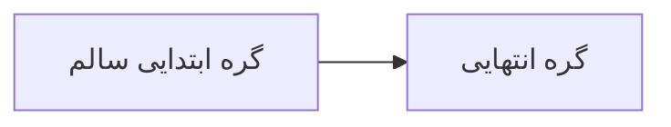
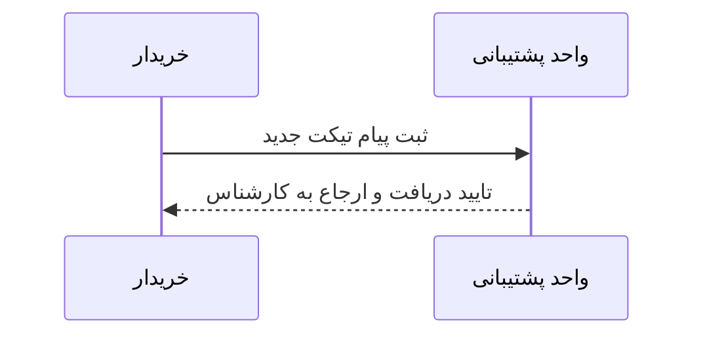

# تاب‌آوری در برابر خطاهای نگارشی (Syntax Error Resilience)

این سند برای بررسی نحوه رفتار افزونه در زمان مواجهه با **خطاهای نحوی و ناقص بودن کد مِرمید** طراحی شده است.

## پیش‌زمینه و هدف آزمون
در حین تایپ کردن زنده در محیط IDE، کد Mermaid تا پیش از تکمیل خطوط ممکن است دارای خطای نحوی (Syntax Error) باشد.
سیستم رندر افزونه **Markdown RTL** طوری بهینه‌سازی شده که:
1. خطای یک بلوک نباید سایر بلوک‌های سالم صفحه یا رندر کل مارک‌داون را متوقف کند.
2. در نموداری که قبلاً رندر شده، هنگام تایپِ موقتاً ناقص، آخرین وضعیت سالم حفظ می‌شود.
3. در نموداری که از ابتدا ناقص است، پیام خطای شفاف در یک کارت شکیل نمایش داده می‌شود به جای شکستن رابط کاربری.

---

## سناریوی ۱: بلوک سالم قبل از خطای نگارشی

این یک بلوک کاملاً سالم است که باید بدون هیچ مشکلی رندر شود:



---

## سناریوی ۲: بلوک دارای خطای نحوی عمدی (Syntax Error)

بلوک زیر دارای سینتکس ناقص و نادرست است (عدم بستن گیومه و ساختار اشتباه فلش):

```mermaid
flowchart TD
    شروع --> گره_شکسته["این متن بسته نشده و دارای خطای عمدی است
    ناقص ->-> A
```

---

## سناریوی ۳: بلوک سالم بعد از خطای نگارشی

بلوک سوم نشان می‌دهد که حتی پس از بروز خطای نگارشی در سناریوی ۲، موتور رندر مِرمید متوقف نشده و بلوک‌های بعدی به درستی پردازش می‌شوند:



---

## نکات آزمون
1. بررسی کنید که سناریوی ۱ و سناریوی ۳ به شکل نمودار کامل و شکیل دیده شوند.
2. سناریوی ۲ باید نشان‌دهنده یک کادر خطای واضح (خطای سینتکس مِرمید) باشد و محیط پیش‌نمایش را مسدود یا سفید نکند.
3. با تصحیح پرانتز/گیومه در سناریوی ۲ در ادیتور، بلافاصله باید نمودار بدون نیاز به رفرش کل سند، به حالت سالم تبدیل شود.
