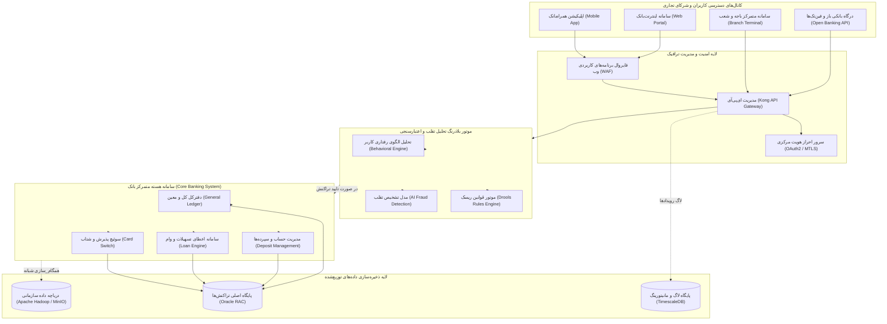

# نمودار چندبخشی و گسترده (Large Multi-Subgraph Diagram)

این سند برای ارزیابی عملکرد و خوانایی در نمودارهای چندبخشی و پرجزئیات (شامل زیرسیستم‌ها، گره‌های پایگاه‌داده و یال‌های مختلف) تهیه شده است.

## هدف آزمون
- بررسی خوانایی دیاگرام‌های بسیار گسترده و چندمرحله‌ای
- بررسی رندر بی‌نقص زیرنمودارها (Subgraphs) و راست‌به‌چپ بودن برچسب‌های متنی
- اطمینان از اسکرول افقی روان برای نمودارهای پهن در قاب کارت پیش‌نمایش
- اعتبارسنجی مقاومت سیستم در برابر شناسه‌های فارسی حاوی نیم‌فاصله

---

## سناریو: معماری کلان سامانه بانکداری باز و مدیریت ریسک

---

## چک‌لیست آزمون
1. **نمایش زیرنمودارها (Subgraphs)**: آیا هر ۵ لایه با حاشیه و عناوین مشخص تفکیک شده‌اند؟
2. **برچسب‌های دوزبانه**: آیا متون فارسی همراه با پرانتزهای انگلیسی بدون به‌هم‌ریختگی حروف رندر می‌شوند؟
3. **تناسب ابعاد**: آیا نمودار با ابعاد مناسب در عرض کادر قرار گرفته و در صورت نیاز اسکرول افقی دارد؟
