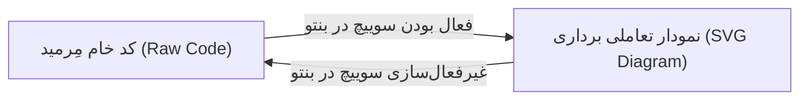

# تغییر وضعیت ویژگی در ویجت بنتو (Bento Feature Toggle Test)

این سند برای بررسی عملکرد سوییچ اختصاصی **Mermaid Diagrams** در ویجت بنتو (دکمه شناور تنظیمات در گوشه پیش‌نمایش) و پنجره تنظیمات اصلی افزونه طراحی شده است.

## پیش‌زمینه و هدف آزمون
افزونه **Markdown RTL** امکان فعال یا غیرفعال‌سازی گزینشی قابلیت‌های مختلف را در اختیار کاربر قرار می‌دهد:
- **جهت‌دهی هوشمند متون (RTL BiDi)**
- **مدیریت و زیباسازی فرانت‌متر (YAML Front Matter)**
- **رندر نمودارهای مِرمید (Mermaid Diagrams)**

---

## سناریوی آزمون: بررسی جابه‌جایی میان حالت گرافیکی و کد خام

---

## چک‌لیست مراحل آزمون
1. **بررسی حالت فعال (Default On)**:
   - سند بالا را باز کنید.
   - نمودار باید به شکل گرافیکی تعاملی رندر شده باشد.
2. **غیرفعال‌سازی از طریق ویجت بنتو**:
   - روی دکمه شناور بنتو در گوشه صفحه کلیک کنید.
   - تیک گزینه **Mermaid Diagrams** را بردارید (غیرفعال کنید).
   - بلافاصله یا پس از به‌روزرسانی پیش‌نمایش، نمودار باید به شکل بلوک کد معمولی با سینتکس هایلایت استاندارد نمایش یابد (کد خام متنی).
3. **فعال‌سازی مجدد**:
   - مجدداً تیک گزینه **Mermaid Diagrams** را بزنید.
   - نمودار باید مجدداً به صورت نمودار گرافیکی با نوار ابزار ظاهر شود.
