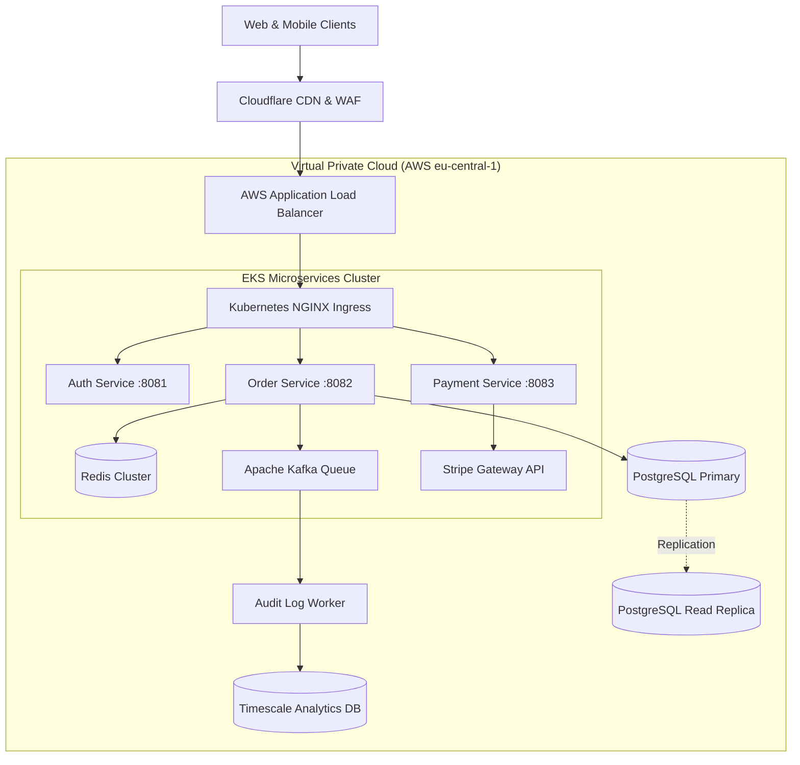
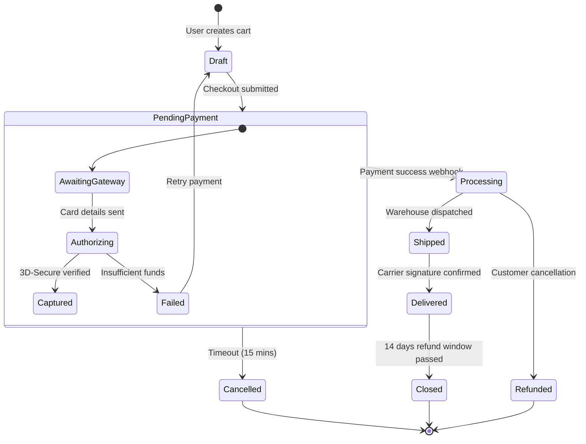

# Pure English Microservices Architecture & State Machine

This test document is written completely in **English** with standard Left-to-Right (LTR) prose, testing pure English text rendering alongside English **Mermaid** state and architecture diagrams.

## Expected Behavior
1. Document prose should remain strictly **Left-to-Right (LTR)**.
2. English headings, lists, and paragraphs should use English/Latin typography with left alignment.
3. Diagrams contain only ASCII/English labels, so they must automatically adopt **JetBrains Mono** font typography without any Persian/Arabic font substitution.
4. Diagram controls (Zoom, Pan, Source toggle, Copy) should function smoothly.

---

## 1. System Distributed Architecture

The following flowchart outlines the backend infrastructure for a high-availability cloud workload.

---

## 2. Order Lifecycle State Diagram

State machines should preserve strict LTR orientation, arrow paths, and monospace node labels.

---

## Verification Checklist
- [ ] Heading 1 and Heading 2 are left-aligned.
- [ ] Diagram text uses `JetBrains Mono` without Persian fonts.
- [ ] Fullscreen zoom and pan controls operate without layout glitch.
- [ ] Toggle to "Source" view preserves exact indentation.
