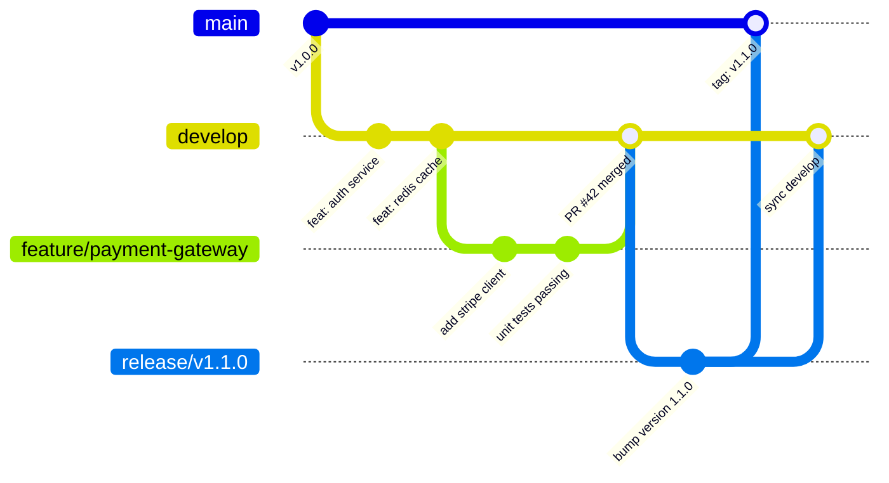
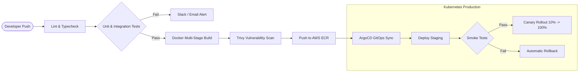
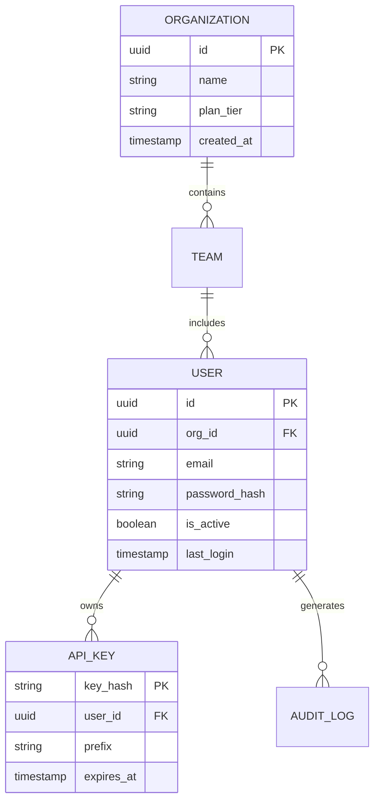

# CI/CD Pipeline & Gitflow Release Workflow

This document tests complex multi-step technical diagrams including **Git Graph** and **Class & ER Diagrams** entirely in **English**.

## Pipeline Overview
Continuous Integration and Deployment (CI/CD) pipelines involve automated linting, test runners, container builds, and deployment stages.

---

## 1. Gitflow Branching Strategy

Testing Mermaid `gitGraph` rendering with English commit tags and branch names:

---

## 2. CI/CD Deployment Flowchart

---

## 3. Entity-Relationship Data Model

---

## Observations
- Pure English prose does not trigger any RTL classes.
- Monospace font `JetBrains Mono` is rendered for all database attributes, branch names, and pipeline stages.
