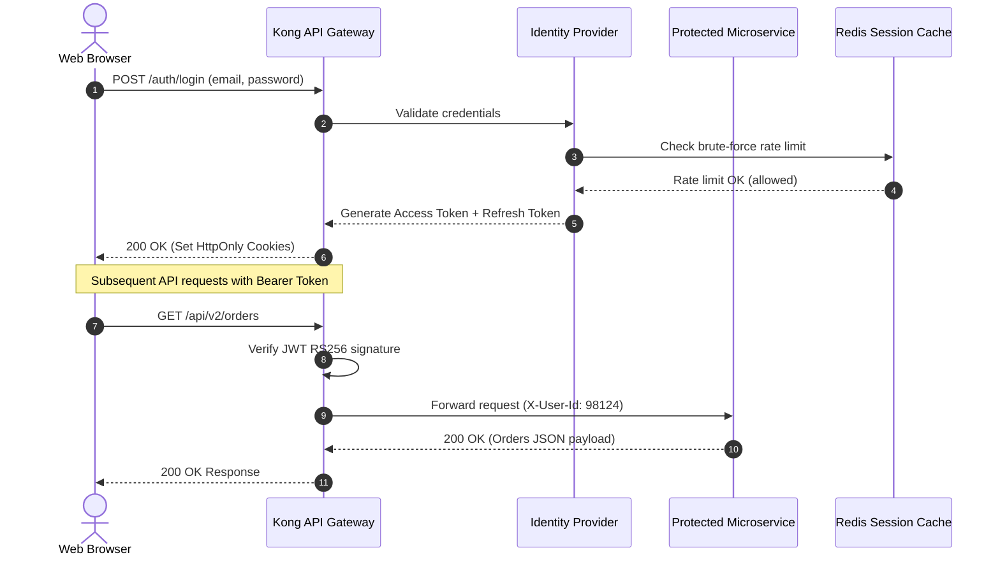
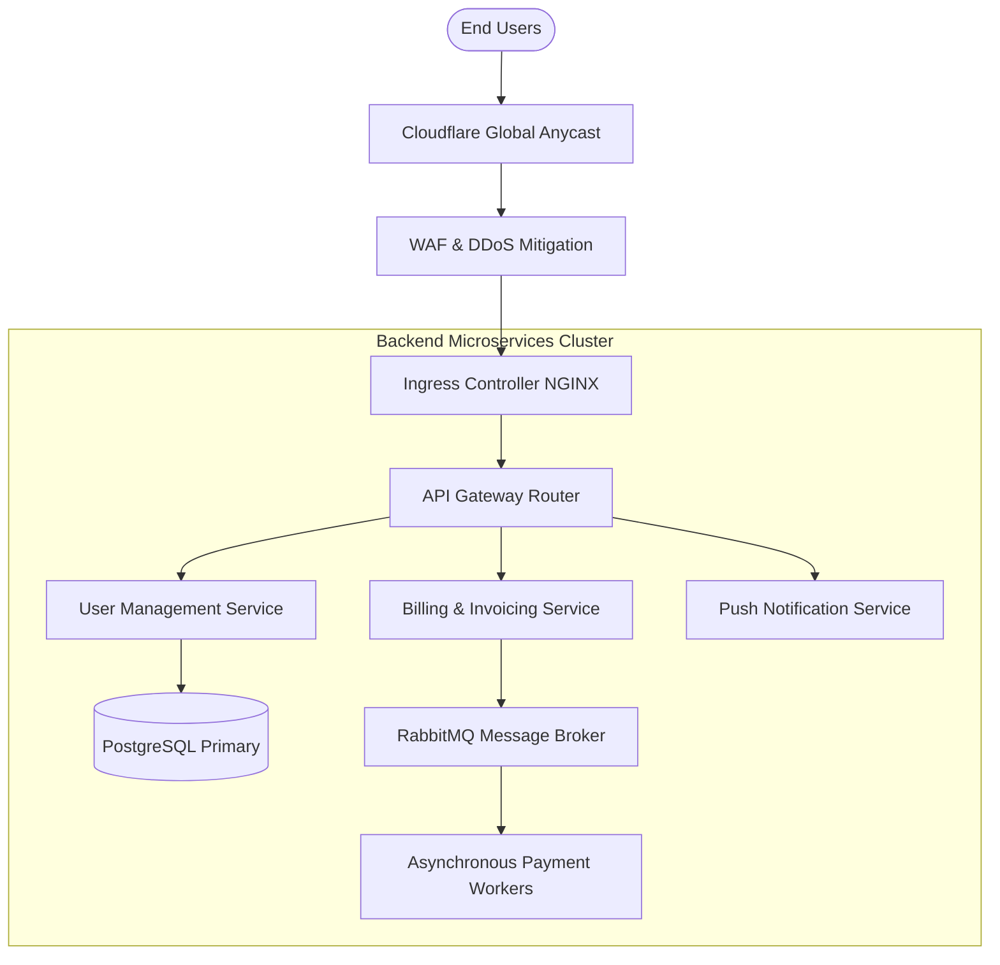
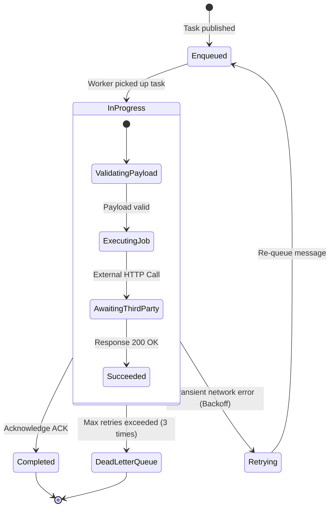

# مستند فنی احراز هویت و امنیت شبکه (متن فارسی با دیاگرام انگلیسی)

این سند برای بررسی عملکرد حالت دو زبانه پلاگین طراحی شده است: **متن توضیحات کاملاً فارسی و راست‌چین (RTL)** است، اما **دیاگرام‌های Mermaid تماماً انگلیسی و چپ‌چین (LTR)** هستند.

## هدف تست
* پاراگراف‌ها، عنوان‌ها و لیست‌های فارسی باید با فونت `وزیرمتن` (Vazirmatn) و با چینش دقیق راست به چپ رندر شوند.
* دیاگرام‌های Mermaid چون متون داخلشان انگلیسی خالص است، باید بدون اعمال جهت RTL یا فونت فارسی، با فونت `JetBrains Mono` و چینش استاندارد چپ‌به‌راست نمایش داده شوند.
* بلوک‌های کد (`pre` و `code`) و دیاگرام‌ها نباید ساختار راست‌به‌چپ متن را به هم بریزند (Code & Diagram Isolation).

---

## ۱. معماری احراز هویت با پروتکل OAuth 2.0 و JWT

در این سناریو، کاربر ابتدا از طریق درگاه احراز هویت متمرکز لاگین کرده و توکن‌های دسترسی دریافت می‌کند:

---

## ۲. دیاگرام جریان مسیریابی درخواست‌ها در زیرساخت ابری

توضیحات جریان ترافیک:
1. ابتدا درخواست‌های کاربران به شبکه توزیع محتوا (CDN) وارد می‌شوند.
2. ترافیک پس از بررسی فایروال به لود بالانسر و سپس سرویس‌های کانتینری هدایت می‌شود.

---

## ۳. جدول وضعیت‌های صف پیام (State Diagram)

وضعیت رویدادها در صف پیام‌رسان هنگام پردازش غیرهمگام:

---

## نتیجه‌گیری و بررسی صحت نمایش
* بررسی کنید که متون فارسی این صفحه کاملاً راست‌چین و بدون درهم‌ریختگی باشند.
* بررسی کنید که لیبل‌های تمام باکس‌ها، عنوان‌های گره‌ها و متن پیام‌های سکوئنس در دیاگرام با فونت انگلیسی مونو‌اسپیس و جهت چپ‌به‌راست نمایش یابند.
